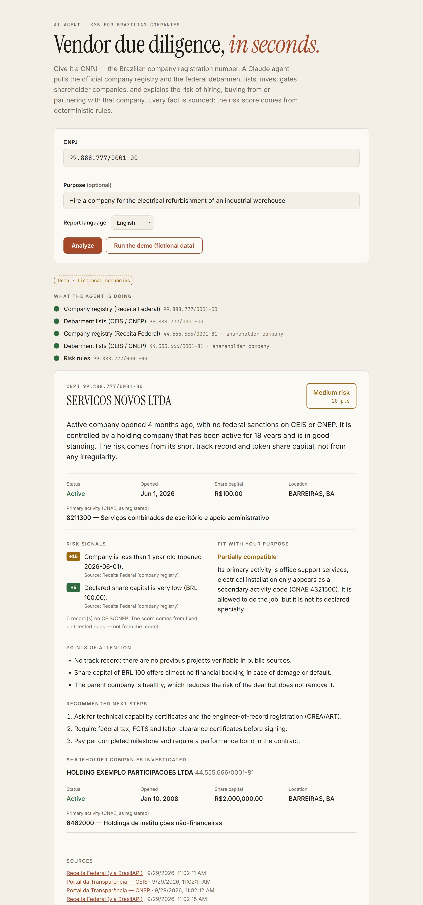
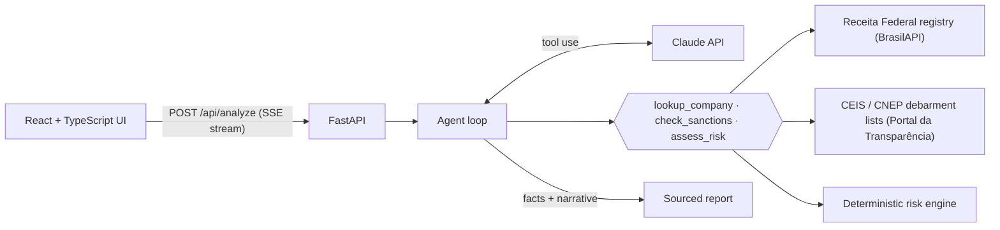

# CNPJ Due Diligence Agent

**An AI agent that runs KYB / vendor due diligence on Brazilian companies using official public data — and never lets the LLM invent a fact.**

[](https://github.com/lincolnjesuino-cmyk/cnpj-due-diligence-agent/actions/workflows/ci.yml)


[](LICENSE)

**▶ [Live demo](https://lincolnjesuino-cmyk.github.io/cnpj-due-diligence-agent/?demo)** — plays a recorded run with fictional companies (no API key needed).



---

## The problem

Before a company in Brazil hires a supplier, signs a partner or onboards a B2B customer, someone has to check that the counterparty exists, is active, is not barred from public contracts and actually does what it claims to do. The data is public, but it is scattered across government registries, it is in Portuguese, and checking it by hand is slow and easy to get wrong.

This project does it in seconds: you give it a **CNPJ** (the Brazilian company registration number) and, optionally, what you intend to do with that company. An agent built on the Claude API:

1. pulls the company's record from the **federal company registry** (Receita Federal),
2. checks the **federal debarment lists** (CEIS and CNEP, on Portal da Transparência),
3. **follows the ownership chain** — if a shareholder is itself a company, it investigates that one too,
4. runs a **deterministic risk engine** over the facts it found,
5. writes a short, sourced assessment: summary, whether the company's registered activities fit your purpose, points of attention and concrete next steps.

The report streams to the UI step by step, in English or Portuguese.

## Design decisions

These are the choices I'd want to discuss in an interview.

**1. Facts come from code; the model only writes the narrative.**
Company data, sanctions and the risk score are fetched and computed by plain Python. The model decides *what to investigate* and *how to explain it*, but the final report assembles facts from the tool results, not from the model's text. Even if the model skipped a tool call, the facts are fetched before the report is built (tested in [`test_agent.py`](backend/tests/test_agent.py)).

**2. The risk score is deterministic and unit-tested.**
Every point is traceable to a rule and a public source ([`risk.py`](backend/app/risk.py)). The model receives the score through an `assess_risk` tool and is instructed to explain it, not to override it. Same input → same level, every time — which is what a compliance team needs to trust it.

**3. Structured output + strict tools.**
Tool inputs are validated by the API (`strict: true`), and the final answer is constrained to a JSON schema (`output_config.format`), then validated again with Pydantic. No regex parsing of free text.

**4. It degrades instead of failing.**
If the debarment API is down or not configured, the report is still produced and clearly marked *incomplete* rather than silently "clean". Tool errors (invalid CNPJ, company not found) are returned to the model as `is_error` results so it can recover, not raised.

**5. Agent loop written by hand, on purpose.**
The loop ([`agent.py`](backend/app/agent.py)) runs parallel tool calls with `asyncio.gather`, returns all results in a single message (so the model keeps calling tools in parallel), caches lookups per run, caps the number of turns, handles `refusal` / `max_tokens` stop reasons and enables server-side model fallbacks.

**6. Evals, not vibes.**
[`evals/run_evals.py`](backend/evals/run_evals.py) runs the real agent against fixed, synthetic fixtures and grades behavior with code: *did it investigate the shareholder company? did it call the risk tool? does it flag a closed company as critical and advise against proceeding? does it cite CEIS when the company is debarred?* Prompt changes are measured, not guessed.

## Architecture



| Layer | Stack |
| --- | --- |
| Agent | Python 3.12, Anthropic SDK (tool use, structured outputs), asyncio |
| API | FastAPI, Server-Sent Events, httpx, Pydantic v2 |
| Frontend | React 19, TypeScript (strict), Vite |
| Quality | pytest + respx (33 tests), Vitest + Testing Library, Ruff, oxlint, behavioral evals |
| Delivery | Docker Compose, GitHub Actions CI, GitHub Pages (demo) |

## Run it locally

You need an [Anthropic API key](https://console.anthropic.com/settings/keys). A free [Portal da Transparência key](https://portaldatransparencia.gov.br/api-de-dados/cadastrar-email) is optional (without it, debarment lists are reported as "not checked").

```bash
cp .env.example backend/.env   # then fill in your keys
docker compose up --build
```

Open http://localhost:8080.

<details>
<summary>Without Docker</summary>

```bash
# backend
cd backend
python -m venv .venv && source .venv/bin/activate   # Windows: .venv\Scripts\activate
pip install -e ".[dev]"
uvicorn app.main:app --reload --port 8000

# frontend (another terminal)
cd frontend
npm install
npm run dev      # http://localhost:5173, proxies /api to :8000
```
</details>

## Tests and evals

```bash
cd backend && pytest -q && ruff check .          # unit + integration, no network, no API key
cd frontend && npm test && npm run typecheck     # UI behavior, CNPJ validation, demo replay
cd backend && python -m evals.run_evals          # real Claude calls, ~5 cases, prints a scorecard
```

All tests run offline: HTTP sources are mocked with `respx`, and the agent loop is tested against a scripted stand-in for the Claude client. Fixtures are **synthetic** — no real company or person data lives in this repository.

## Project structure

```
backend/
  app/
    agent.py      # agent loop, prompt, tool definitions, report assembly
    risk.py       # deterministic risk rules
    sources.py    # Receita Federal + Portal da Transparência clients
    cnpj.py       # CNPJ check-digit validation
    main.py       # FastAPI + SSE streaming
  tests/          # pytest suite with synthetic fixtures
  evals/          # behavioral evals against the real model
frontend/
  src/            # React UI, SSE client, demo replay
```

## Glossary (Brazilian context)

- **CNPJ** — the 14-digit national registration number every Brazilian company has.
- **Receita Federal** — Brazil's federal revenue service; publishes each company's registration status, activities (**CNAE** codes) and shareholders (**QSA**).
- **CEIS / CNEP** — federal registries of companies barred from public contracts or punished under the Anti-Corruption Law (Law 12,846/2013), published on **Portal da Transparência**.

## Limitations and next steps

- Covers federal sources only; state and municipal debarment lists, court records and tax-debt certificates are natural next tools.
- Shareholders who are individuals are not screened (CPFs are masked in public data by design).
- The hosted demo is a recorded run; a hosted live version would need rate limiting and per-user keys.

---

Built by **[Lincoln Massari](https://www.linkedin.com/in/lincolnmassari)** — full-stack developer working on automation and AI agents. The idea comes from my day-to-day work automating manual checks against government systems. Released under the [MIT License](LICENSE).
